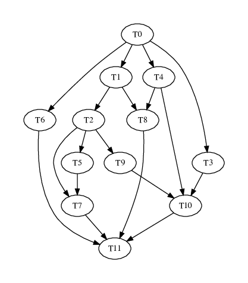

# SLOT FPGA scheduling

This project contains all instances of the FPGA scheduling problem used for the paper submited to DSD'2020 and the results obtained when solving them with the proposed method (`SLOT`), a state-of-the-art method (`HEFT-NF`) and an absolute reference computed with a Mixed-Integer Linear Programming package (`GLPK`, the GNU Linear Programming Kit).

## Results

The `WorkloadResults` folder contains one sub-folder per workload type, from 6 to 15 tasks. Each contains:

- A Comma Seperated Value (CSV) file, `tXX.csv` presenting the `SLOT` results.
- A Comma Seperated Value (CSV) file, `tXX.heft-nf.csv` presenting the `HEFT-NF` results.
- The Cumulative Distribution Function (CDF) plots of the differences with the MILP optimum, in PDF format, `CDFXTasks.pdf`.

The `overall` folder contains the overall CDF graph computed on all problem instances.

The CSV files contain 3 tables. In the first table there is one row per problem instance with the following columns (`ALGO` is the evaluated algorithm, `SLOT` or `HEFT-NF`):

| Column   | Description                                                                                       |
| :------- | :-----------------                                                                                |
| NAME     | unique name of the instance                                                                       |
| T        | number of tasks                                                                                   |
| E        | total number of edges                                                                             |
| MMIP     | optimal makespan found by MILP                                                                    |
| M`ALGO`  | makespan found by `ALGO`                                                                          |
| UMIP     | time taken by MILP in micro-seconds                                                               |
| U`ALGO`  | time taken by `ALGO` in micro-seconds                                                             |
| S        | true if the scheduling found by `ALGO` is the same as the scheduling found by MILP                |
| M        | true if the makespan found by `ALGO` is the same as the one found by MILP (with a 0.1% tolerance) |

Note: the instance name provides extra information. `xc7s25 t06 e001 r0.1 R0.5 d10.0 D50.0 s034`, for example, indicates that this 6-task (`t06`) instance has only 1 internal edge (`e001`) between tasks (internal edges exclude source and sink incident edges).

The second table, near the end of the file, summarizes the scheduling and makespan differences between `ALGO` and the optimal MILP solution. Makespan differences are expressed in percentage of the MILP makespan. The `M0.1` set is the set of instances for which `ALGO` makespan is more than 0.1% greater than MILP.

| Column        | Description                                                                                          |
| :-------      | :-----------------                                                                                   |
| T             | number of tasks                                                                                      |
| E             | total number of edges                                                                                |
| N             | total number of instances with this number of tasks and edges                                        |
| SchedDiff     | number of instances for which the scheduling found by `ALGO` is different from the one found by MILP |
| SchedMkspDiff | number of instances in `M0.1`                                                                        |
| MinMkspDiff   | minimum makespan difference in `M0.1`                                                                |
| MaxMkspDiff   | maximum makespan difference in `M0.1`                                                                |
| AvgMkspDiff   | average makespan difference in `M0.1`                                                                |
| StdMkspDiff   | standard deviation of the makespan differences in `M0.1`                                             |

The third table, at the end of the file, summarizes the running time differences between `ALGO` and the MILP solver:

| Column        | Description                                                   |
| :-------      | :-----------------                                            |
| T             | number of tasks                                               |
| E             | total number of edges                                         |
| N             | total number of instances with this number of tasks and edges |
| MinMipTime    | minimum execution time taken by MILP                          |
| MaxMipTime    | maximum execution time taken by MILP                          |
| AvgMipTime    | average execution time taken by MILP                          |
| StdMipTime    | standard-deviations of MILP execution timing                  |
| Min`ALGO`Time | minimum execution time taken by `ALGO`                        |
| Max`ALGO`Time | maximum execution time taken by `ALGO`                        |
| Avg`ALGO`Time | average execution time taken by `ALGO`                        |
| Std`ALGO`Time | standard-deviation of `ALGO` execution time                   |


## Problem instances

The `Testbench` folder and its sub-folders contain the specifications of all problem instances used for the evaluation in JSON format. The `Testbench/xc7s25/t12/e010/r0.1R0.5d10.0D50.0/038.app.json` file, for example, specifies a 12-tasks instance with 10 internal edges (internal edges exclude source and sink incident edges):

```json
{
  "name": "xc7s25 t12 e010 r0.1 R0.5 d10.0 D50.0 s038",
  "task": [
    { "resource": [ 0, 0, 0 ], "duration": 0.0 },
    { "resource": [ 6591, 14, 14 ], "duration": 34.014594598271053 },
    { "resource": [ 9853, 19, 10 ], "duration": 32.775429746662752 },
    { "resource": [ 9401, 32, 9 ], "duration": 17.229717704656363 },
    { "resource": [ 3841, 28, 20 ], "duration": 49.817077184180278 },
    { "resource": [ 9271, 8, 22 ], "duration": 48.56182585650491 },
    { "resource": [ 5821, 24, 20 ], "duration": 31.173848548485125 },
    { "resource": [ 7198, 27, 6 ], "duration": 46.418973089234981 },
    { "resource": [ 9681, 17, 18 ], "duration": 24.737838850529315 },
    { "resource": [ 7190, 33, 22 ], "duration": 44.93350100056611 },
    { "resource": [ 10253, 30, 17 ], "duration": 43.371482419771141 },
    { "resource": [ 0, 0, 0 ], "duration": 0.0 }
  ],
  "adjacency": [
    [ 1, 3, 4, 6 ],
    [ 2, 8 ],
    [ 5, 7, 9 ],
    [ 10 ],
    [ 8, 10 ],
    [ 7 ],
    [ 11 ],
    [ 11 ],
    [ 11 ],
    [ 10 ],
    [ 11 ],
    [ ]
  ]
}
```

The `task` array lists the 12 tasks and for each, its consumption of each of the 3 resource types and its duration in milliseconds. Note that the source task (task 0) and the sink task (task 11) are dummy tasks with zero resources consumption and zero duration: they are used only to close the Directed Acyclic Graph that represents the inter-tasks dependencies.

The `adjacency` array specifies the inter-task data dependencies. The first sub-array is the list of the immediate successors of task 0 (source task). The second lists the immediate successors of task 1... Note that the sink task (task 11) has no successors.

The DAG of this instance is the following:



The target FPGA for this evaluation is specified in JSON format in `Testbench/xc7s25.json`:

```json
{
"name": "xc7s25",
"reconfiguration": 0.040000,
"resource": [23360, 80, 45]
}
```

The reconfiguration time (40 ms) is expressed in seconds. The 3 resource types are, in order, Configurable Logic Blocks (CLB), Digital Signal Processing blocks (DSP) and Block RAM (BRAM), with respective total amounts of 23360, 80 and 45.

The `Testbench/unusedGraphs.txt` file contains the list of problem instances that could not be included in this evaluation because the time taken by the MILP solver was too long and the solver had to be interrupted.

<!-- vim: set textwidth=0: -->
